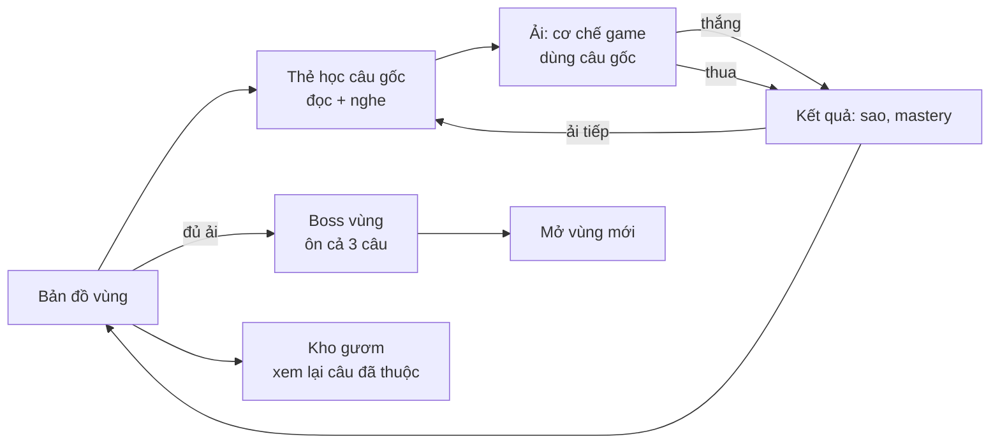

# Lữ Khách — Tài liệu thiết kế game

| | |
|---|---|
| Phiên bản tài liệu | 1.0, ngày 07/10/2026, khớp với game bản 0.2 |
| Chủ dự án | taibt |
| Trạng thái | Vùng 1 (3 ải + boss) và Vùng 2 (3 ải) đã chơi được, trên web và APK Android |
| Tài liệu liên quan | [README](../README.md) (cách chơi, cách sửa hình) · [CLAUDE.md](../CLAUDE.md) (ghi chú kỹ thuật cho người và AI làm tiếp) |

Các con số trong tài liệu (tốc độ, thời gian, sát thương) lấy từ code bản 0.2. Ký hiệu "Thường / Dễ" là giá trị ở mức Thường và ở mức Dễ.

---

## 1. Tóm tắt

**Lữ Khách** là game vượt ải offline. Trẻ học thuộc lòng **câu gốc Kinh Thánh** bằng cách *chơi*: chạy, nhảy, hứng, bắn cung, đánh boss. Học thuộc không còn là đọc đi đọc lại.

Người chơi là một lữ khách nhỏ đi về **Thành Thiên Quốc**, qua những vùng đất lấy cảm hứng từ *Thiên Lộ Lịch Trình* (John Bunyan). Mỗi câu gốc thuộc được là **một thanh gươm Lời Chúa**. Ở cuối mỗi vùng có một boss nói "lời dối", và người chơi phải chọn đúng thanh gươm để đáp trả.

| | |
|---|---|
| Thể loại | Vượt ải, nhiều cơ chế mini-game khác nhau; học tập |
| Người chơi | Thiếu nhi 6–11 tuổi (có mức Dễ và giọng đọc) và thanh thiếu niên 12–16 tuổi (mức Thường) |
| Nền tảng | Máy tính bảng và điện thoại Android (APK, màn ngang); trình duyệt máy tính |
| Kết nối mạng | Không cần. Không quảng cáo, không mua bán, không thu thập dữ liệu |
| Một lượt chơi | Mỗi ải 1–3 phút; một buổi chơi 10–15 phút |
| Bản dịch Kinh Thánh | Bản Truyền Thống 1926, chép nguyên văn |

### Trụ cột thiết kế

1. **Chơi thật, không phải bài tập trá hình.** Mỗi ải có một cơ chế game riêng: phản xạ, căn thời điểm, nhắm bắn, kéo thả. Ải sau không lặp lại cơ chế của ải trước. Nếu bỏ câu gốc ra mà ải vẫn vui thì thiết kế đã đúng.
2. **Thuộc đúng từng chữ.** Lỗi sai được thiết kế có chủ đích. Các lựa chọn sai là những chữ trẻ *hay nhầm thật* (ví dụ "trông cậy" với "trông đợi", "chim sẻ" với "chim ưng"), không phải chữ ngẫu nhiên.
3. **Hiểu để dùng.** Boss kiểm tra người chơi có biết *câu nào dùng khi nào* hay không, không chỉ kiểm tra thuộc lòng.
4. **Ấm áp và an toàn.** Nét vẽ truyện tranh thiếu nhi, không đáng sợ, không máu me. Thua thì "thử lại nào", không bị phạt nặng.

---

## 2. Thế giới và câu chuyện

### Bối cảnh

Lữ khách rời làng quê lên đường về Thành Thiên Quốc. Trên đường có những nơi làm người ta nản lòng, lạc lối hoặc bị cám dỗ. Lữ khách không có phép thuật hay vũ khí nào khác ngoài **Lời Chúa** (Ê-phê-sô 6:17, "gươm của Thánh Linh, là Lời Đức Chúa Trời").

### Nhân vật

| Nhân vật | Vai trò | Ghi chú |
|---|---|---|
| **Lữ Khách** | Nhân vật người chơi điều khiển | Bé trai khoảng 10 tuổi, áo xanh lá, ba lô, gậy gỗ. Có các tư thế: đứng, chạy (4 khung), nhảy (3 khung), cầm gươm sáng, giương cung, với tay hứng, ngã, nhảy mừng. |
| **Bùn Buồn** | Boss Vùng 1 | Cục bùn buồn ngủ có đám mây mưa trên đầu. Đáng thương nhiều hơn đáng sợ. Khi thua thì tan thành vũng bùn mỉm cười và hoa mọc lên. |
| **Ông Khôn Đời** | Kẻ dẫn sai đường ở Vùng 2 | Chỉ "lối tắt" dưới chân Núi Sấm Sét. Mới xuất hiện trong lời dẫn truyện; dự kiến làm boss Vùng 2 (mục 9). |
| **Bầy Quạ** | Kẻ cướp Lời ở Vùng 2 | Lấy từ dụ ngôn người gieo giống: chim chóc đến ăn mất hạt giống. Khi bị bắn trúng, quạ chỉ giật mình bay đi, không chết. |

### Các vùng (lộ trình)

Tên các vùng là tên tạm. Khi làm thật nên đối chiếu với bản dịch tiếng Việt của *Thiên Lộ Lịch Trình*.

| # | Vùng | Trong nguyên tác | Trạng thái |
|---|---|---|---|
| 1 | **Vũng Lầy Chán Nản** | Slough of Despond | ✅ 3 ải + boss Bùn Buồn |
| 2 | **Cửa Hẹp** | Mr. Worldly Wiseman, núi Sinai, Wicket Gate, tên bắn từ lâu đài Bê-ên-xê-bun | ✅ 3 ải; chưa có boss |
| 3 | Nhà Người Giải Nghĩa | Interpreter's House | Dự kiến |
| 4 | Thập Tự Giá và Đồi Gian Nan | Gánh nặng rơi xuống; Hill Difficulty, lữ khách đánh rơi cuộn giấy | Dự kiến |
| 5 | Cung Điện Đẹp Đẽ | Palace Beautiful, nơi nhận áo giáp | Dự kiến |
| 6 | Trũng Khiêm Nhường | Trận chiến với A-bô-ly-ôn | Dự kiến |
| 7 | Trũng Bóng Sự Chết | Valley of the Shadow of Death (Thi Thiên 23) | Dự kiến |
| 8 | Hội Chợ Phù Hoa | Vanity Fair | Dự kiến |
| 9 | Lâu Đài Nghi Ngờ | Người Khổng Lồ Tuyệt Vọng; chìa khoá "Lời Hứa" | Dự kiến |
| 10 | Núi Khoái Lạc, Sông, Thành Thiên Quốc | Kết thúc hành trình | Dự kiến |

---

## 3. Vòng chơi

- **Vòng ngắn (1–3 phút):** học thẻ câu gốc, chơi ải, xem kết quả. Thẻ học tự đọc to câu gốc; muốn nghe lại thì bấm "Nghe lại".
- **Vòng vùng (15–30 phút):** 3 ải, mỗi ải một câu gốc, rồi đến boss ôn cả 3 câu. Thắng boss thì mở vùng sau.
- **Vòng dài:** Kho gươm tích luỹ các câu đã thuộc kèm độ thành thạo. Chơi lại ải để lên sao và tăng mastery.

### Luật chung

- Mỗi ải có **3 tim**. Mỗi lỗi mất 1 tim. Hết tim thì thua; màn kết quả nói "Chưa qua — thử lại nhé!" và không phạt gì thêm.
- **Số sao bằng số tim còn lại** khi thắng, tối thiểu 1 sao. Sao lưu theo điểm cao nhất.
- Mỗi lần thắng một ải thì câu gốc của ải đó được +1 **mastery** (boss cộng cho cả 3 câu). Kho gươm hiển thị tối đa 5 ngôi sao mastery.
- Mở khoá: phải có ít nhất 1 sao ở ải trước. Vùng sau mở khi ải cuối của vùng trước có sao.
- Qua ải 3 thì nhận **Khiên Đức Tin**: đỡ được 1 lần bị ném bùn trong trận boss.
- **Mức Dễ** áp dụng cho mọi ải: 2 lựa chọn thay vì 3, đồ vật chạy hoặc rơi chậm hơn, có thêm thời gian, và ở ải bắn cung thì mũi tên tự bám về con quạ gần chỗ chạm.

---

## 4. Thiết kế việc học

### Học thuộc từ to đến nhỏ

Mỗi câu gốc được chia theo nhiều mức, từ cụm lớn đến từng chữ. Các ải luyện từ thứ tự các cụm trước, rồi đến từng chữ chính xác.

| Mức chia | Ví dụ (Ê-sai 40:31) | Luyện điều gì |
|---|---|---|
| Cụm lớn (`chunks`) | "Nhưng ai trông đợi Đức Giê-hô-va" · "thì chắc được sức mới," … | Thứ tự các ý |
| Mảnh (`pieces`, `steps`, `drops`, `tiles`) | "Nhưng ai" · "trông đợi" … | Thứ tự trong từng ý |
| Từng chữ (`words`) | "Hỡi" · "những" · "kẻ" … | Chính xác từng chữ |

Nhiều ải chơi **2 lượt**: lượt 1, lựa chọn sai là *các cụm khác của cùng câu* (luyện thứ tự); lượt 2, lựa chọn sai là *chữ gần giống* (luyện chính xác).

### Các nguyên tắc học tập được dùng

- **Nhớ lại thay vì đọc lại:** mọi ải đều bắt trẻ *chọn phần tiếp theo* từ trí nhớ. Thanh câu gốc trên đầu màn hình chỉ hiện những phần đã đúng, phần còn lại là dấu chấm.
- **Phản hồi ngay:** đúng thì có âm thanh, hiệu ứng và câu tự điền thêm; sai thì rung, mất tim, và ở nhiều ải hiện luôn đáp án đúng ("Đúng là: …").
- **Bẫy chữ gần giống:** mỗi phần của câu có 2 bẫy viết tay (đồng nghĩa, cùng chữ cái đầu, chữ trẻ hay nói nhầm). Qua được bẫy nghĩa là nhớ đúng nguyên văn.
- **Gợi ý giảm dần:** ải Đường Đêm chỉ cho thấy chữ cái đầu của mỗi từ; boss chuyển từ cụm lớn sang mảnh nhỏ khi còn dưới nửa máu.
- **Nghe và nhìn cùng lúc:** mọi câu gốc có giọng đọc, giúp các em 6–7 tuổi chưa đọc trôi chảy.
- **Dùng đúng chỗ:** mỗi câu gốc gắn với một hoàn cảnh (`theme`), ví dụ "Gươm này dùng khi mệt mỏi, kiệt sức". Boss nói lời dối, người chơi chọn câu đáp trả. Đây là bước từ *thuộc* sang *biết dùng*.

### Luật về câu gốc

- Chép nguyên văn bản BTT 1926. Code tự kiểm tra mọi cách chia đều ghép lại đúng nguyên văn.
- Chỉ được bỏ phần dẫn chuyện ở đầu câu (ví dụ "Vậy Đức Chúa Jêsus đáp rằng:").
- Chữ bẫy và câu `theme` nên được người phụ trách thiếu nhi đọc duyệt lại.

---

## 5. Danh mục các ải

### Ải 1 — Lối Hẹp (Runner) · Ê-sai 40:31

- **Bối cảnh:** con đường đất băng qua đầm lầy sương mù.
- **Lối chơi:** lữ khách tự chạy. Biển gỗ bay tới trên 3 làn, mỗi biển mang một cụm. Chạm làn, vuốt lên/xuống hoặc dùng phím mũi tên để đổi làn và đâm vào biển đúng.
- **Lượt chơi:**
  - Lượt 1: 5 cụm, lựa chọn sai là các cụm khác.
  - Lượt 2: chạy nhanh hơn 15%, lựa chọn sai là chữ gần giống.
- **Khi sai:** mất 1 tim, nhân vật trượt bùn, hiện "Đúng là: …", và **câu vẫn đi tiếp** (đã chỉ ra đáp án đúng).
- **Thông số:** tốc độ chạy 195 / 150 px/s; 3 / 2 biển mỗi lượt.

### Ải 2 — Qua Đầm Lầy (River) · Thi Thiên 40:2

- **Lối chơi:** đứng trên một hòn đá. Phía trước nổi lên 3 hòn đá, mỗi hòn mang một mảnh câu (12 mảnh). Chạm đúng hòn thì lữ khách nhảy sang và cảnh trôi theo.
- **Áp lực:** bùn dâng. Hết 10 / 15 giây ở một bước thì mất 1 tim và đồng hồ tính lại.
- **Khi sai:** hòn đá sai chìm xuống, mất 1 tim, chọn tiếp trong các hòn còn lại.

### Ải 3 — Đường Đêm (Lantern) · Ma-thi-ơ 11:28

- **Lối chơi:** trời tối, chỉ có quầng sáng quanh lữ khách. Phía dưới màn hình là hàng **chữ cái đầu** của 20 từ, chữ hiện tại sáng lên. Chọn đúng chiếc đèn mang từ tiếp theo thì đèn được thắp, treo bên đường và đường sáng thêm.
- **Áp lực:** đèn của lữ khách cạn dầu sau 11 / 16 giây, quầng sáng thu nhỏ dần. Cạn dầu thì mất 1 tim.
- **Phần thưởng:** qua ải thì nhận Khiên Đức Tin.

### Ải Boss — Bùn Buồn · ôn cả 3 câu của Vùng 1

- **Trước trận:** thẻ ôn 3 thanh gươm, mỗi gươm kèm hoàn cảnh dùng và nút nghe.
- **Mỗi hiệp đấu:**
  1. Bùn Buồn nói một lời dối (có giọng đọc), ví dụ *"Không ai kéo bạn ra khỏi đống bùn này đâu…"*.
  2. Người chơi **chọn 1 trong 3 thanh gươm**. Chọn đúng câu đáp trả lời dối đó thì trúng điểm yếu, **sát thương ×2**. Chọn câu khác vẫn đánh được, và game chỉ ra câu nào mới đúng.
  3. Bấm các mảnh câu theo đúng thứ tự (mảnh được xáo trộn). Mỗi mảnh đúng là một nhát chém.
- **Sát thương:**
  - Mỗi mảnh đúng: `12 × (2 nếu trúng điểm yếu) × (1 + 0,1 × combo)`, combo tính tối đa 6.
  - Hoàn thành cả câu: thêm 30 (×2 nếu trúng điểm yếu).
  - Boss có 450 máu. Trúng điểm yếu mọi hiệp thì gục sau khoảng 3 hiệp; không trúng hiệp nào thì khoảng 4 hiệp.
- **Boss đánh trả:**
  - Bấm sai một mảnh: bị ném bùn ngay và mất combo. Sai 2 lần liên tiếp thì mảnh đúng phát sáng gợi ý.
  - Thanh "sắp ném bùn" đầy sau 32 / 45 giây thì cũng bị ném bùn.
  - Khiên Đức Tin đỡ lần ném đầu tiên.
- **Giai đoạn 2:** khi boss còn dưới nửa máu, câu được chia thành các mảnh nhỏ hơn.
- **Lời dối và câu là điểm yếu:**

  | Lời dối | Điểm yếu |
  |---|---|
  | "Bạn mệt quá rồi… nằm xuống đây ngủ luôn đi…" | Ê-sai 40:31 |
  | "Không ai kéo bạn ra khỏi đống bùn này đâu…" | Thi Thiên 40:2 |
  | "Gánh nặng quá… chẳng có chỗ nào để nghỉ đâu…" | Ma-thi-ơ 11:28 |

### Ải 4 — Núi Sấm Sét (Catch) · Châm Ngôn 3:5-6

- **Bối cảnh:** Ông Khôn Đời chỉ một "lối tắt", và lối ấy dẫn tới chân núi đá lửa.
- **Lối chơi:** một hàng 3 / 2 cuộn chữ hiện trên trời, rồi lần lượt rơi xuống (cuộn đầu sau 0,9 giây, các cuộn sau cách nhau 0,85 / 1,2 giây). Chạm hoặc giữ ngón tay để lữ khách chạy tới chỗ đó, và hứng đúng cuộn có mảnh tiếp theo (11 mảnh).
- **Rủi ro:**
  - Hứng nhầm cuộn sai: mất 1 tim.
  - Để cuộn đúng rơi xuống đất: không mất tim, lượt đó rơi lại.
  - Đá lửa rơi mỗi 3 / 4,5 giây (dao động khoảng ±20%); 45% / 30% số đá nhắm gần chỗ lữ khách đứng; tốc độ 340 / 260 px/s. Bóng đen và dấu "!" trên mặt đất báo trước chỗ đá rơi. Trúng đá thì mất 1 tim, sau đó được miễn sát thương 1,6 giây.
- **Thông số:** cuộn chữ rơi 125 / 95 px/s. Ở mức Thường, lựa chọn sai gồm 1 chữ gần giống và 1 mảnh khác.
- **Không khí:** chớp nhẹ và sấm rền mỗi 6–10 giây. Chớp chỉ sáng tối đa 18%, không nháy liên tục.

### Ải 5 — Đường Mây (Path) · Giăng 14:6

- **Bối cảnh:** con đường hẹp băng qua vực mây, cần lát từng phiến đá.
- **Lối chơi:** các phiến đá mang chữ bay lên từ dưới vực. **Chạm** (hoặc **kéo**) đúng phiến vào ô vàng trống trước mặt thì phiến đá vào chỗ và lữ khách bước lên. Những phiến đã lát giữ nguyên chữ, nên câu gốc hiện thành con đường phía sau lữ khách.
- **Lượt chơi:**
  - Lượt 1: 8 phiến, lựa chọn sai là các mảnh khác.
  - Lượt 2 "gió mạnh lên": phiến bay nhanh hơn 30%, 70% lựa chọn sai là chữ gần giống.
- **Thông số:**
  - Phiến bay lên với tốc độ 62 / 48 px/s; cứ 1,6 / 2,1 giây có thêm một phiến.
  - Phiến đúng chắc chắn xuất hiện, chậm nhất sau 2 phiến sai (mức Dễ: 1).
  - Bỏ lỡ phiến đúng không bị phạt, chỉ mất thời gian.
- **Áp lực:** phiến đá dưới chân sẽ vỡ sau 12 / 18 giây; khi đó mất 1 tim và đồng hồ tính lại.
- **Khi sai:** phiến sai nứt và rơi xuống mây, mất 1 tim.

### Ải 6 — Tháp Quạ (Archery) · Thi Thiên 119:11

- **Bối cảnh:** trước Cửa Hẹp có tháp quạ đen; quạ bay ra cướp Lời Chúa (dụ ngôn người gieo giống). Câu gốc trả lời thẳng vào chuyện đó: *"Tôi đã giấu lời Chúa trong lòng tôi"*.
- **Lối chơi:** 3 / 2 con quạ bay từ phải sang trái theo đường lượn, mỗi con quắp một cuộn chữ. **Chạm để bắn tên** từ cung của lữ khách về phía điểm chạm. Bắn trúng con quạ giữ chữ tiếp theo thì quạ thả cuộn chữ, cuộn chữ bay về tim của lữ khách.
- **Lượt chơi:**
  - Lượt 1: 7 cụm, lựa chọn sai là các cụm khác.
  - Lượt 2 "từng chữ một": 15 chữ, lựa chọn sai là chữ gần giống, quạ bay nhanh hơn 12%.
- **Kỹ năng:**
  - Tên bay 1900 / 2100 px/s, giữa hai lần bắn phải chờ 0,35 giây. Ở mức Thường phải bắn đón đầu con quạ bay xa. Tên trúng con quạ nào trên đường bay thì tính con đó, kể cả quạ mang chữ sai.
  - Mức Dễ: tên tự bám về con quạ gần chỗ chạm nhất (trong bán kính 150 px).
- **Thông số:** quạ bay 135–165 / 95–115 px/s; các con xuất phát cách nhau 1,0 / 1,2 giây, bay ở 3 độ cao khác nhau.
- **Rủi ro:** bắn trúng quạ mang chữ sai thì mất 1 tim. Quạ mang chữ đúng bay thoát thì quay lại, không mất tim.

### Bảng tổng hợp

| Ải | Cơ chế | Kỹ năng chính | Câu gốc | Số bước |
|---|---|---|---|---|
| 1 Lối Hẹp | Đổi làn khi đang chạy | Phản xạ | Ê-sai 40:31 | 5 + 5 |
| 2 Qua Đầm Lầy | Nhảy đá có giới hạn giờ | Chọn nhanh | Thi Thiên 40:2 | 12 |
| 3 Đường Đêm | Chọn đèn theo chữ cái đầu | Nhớ từng chữ | Ma-thi-ơ 11:28 | 20 |
| Boss Bùn Buồn | Chọn gươm + xếp câu | Hiểu và áp dụng | cả 3 câu Vùng 1 | 3–4 hiệp |
| 4 Núi Sấm Sét | Hứng đồ rơi + né đá | Di chuyển, căn thời điểm | Châm Ngôn 3:5-6 | 11 |
| 5 Đường Mây | Kéo thả vật đang bay | Nhắm và chọn | Giăng 14:6 | 8 + 8 |
| 6 Tháp Quạ | Bắn mục tiêu di động | Nhắm, bắn đón đầu | Thi Thiên 119:11 | 7 + 15 |

---

## 6. Màn hình và giao diện

- **Khung hình:** 1280×720, tự co giãn vừa màn hình, luôn nằm ngang. Máy để dọc thì hiện lời nhắc xoay ngang.
- **Bản đồ vùng:**
  - Ảnh bản đồ vẽ tay, các ải là những vòng tròn đánh số nối bằng đường chấm. Ải đang tới lượt có màu vàng và nhấp nháy; ải bị khoá hiện ổ khoá; ải đã qua hiện sao.
  - Nút chuyển vùng đặt đúng chỗ cổng trên bản đồ: nút "Cửa Hẹp ›" ở góc trên phải Vùng 1, nút "‹ Vũng Lầy" ở góc dưới trái Vùng 2.
  - Lần đầu vào mỗi vùng có bảng giới thiệu câu chuyện kèm giọng đọc.
  - Các nút: âm thanh, mức chơi (Thường/Dễ), Kho gươm.
- **Thẻ học:** câu gốc chữ lớn, địa chỉ câu, hoàn cảnh dùng, nút "Nghe lại" và "Vào ải!".
- **Màn trong ải:**
  - Nút quay lại ở góc trên trái, 3 tim ở góc trên phải.
  - **Thanh câu gốc** ở trên cùng: phần đã đúng hiện chữ, phần còn lại là dấu chấm, độ dài dấu chấm tương ứng độ dài chữ.
  - Thanh thời gian ngay dưới (bùn dâng, đá vỡ, sắp ném bùn), đổi sang màu cam khi còn dưới 35%.
  - Đầu mỗi ải có bảng hướng dẫn một câu.
- **Kết quả:** số sao (bật lên), câu gốc đọc lại, thông báo (nhận khiên, mở vùng), các nút "Chơi lại", "Bản đồ", "Ải tiếp ›" hoặc "Vùng 2 ›".
- **Kho gươm:** 2 cột theo vùng. Mỗi câu gốc là một thanh gươm: câu chưa học hiện "???" và gươm mờ; câu đã học hiện nguyên văn kèm sao mastery.
- **Android:** nút Back hệ thống đưa về bản đồ; đang ở bản đồ thì thoát app. Màn hình không tự tắt khi đang chơi.

---

## 7. Hình ảnh và âm thanh

### Hình ảnh

- **Phong cách:** tranh truyện thiếu nhi, tô màu mềm, viền nâu sẫm, màu ấm, hình khối tròn, ánh sáng hy vọng; *không đáng sợ*. Mọi hình đều sinh từ một style chung, lấy nhân vật Lữ Khách làm ảnh tham chiếu, nên giữ được cùng nét vẽ.
- **Màu giao diện:** nền kem `#fff8e7`, mực `#1d2b22`, vàng nhấn `#ffc93c`, viền dày, góc bo tròn.
- **Font:** *Baloo 2*, hiển thị tốt dấu tiếng Việt chồng tầng.
- **Màu theo vùng:**
  - Vùng 1: xanh rêu và nâu bùn, sương sớm; Đường Đêm chuyển sang xanh đêm.
  - Vùng 2: tím xám của bão ở Núi Sấm Sét, xanh trời và mây trắng ở Đường Mây, hoàng hôn cam tím ở Tháp Quạ.
- **Danh sách hình (bản 0.2, 39 hình):** 9 ảnh nền, 6 tư thế nhân vật, 9 khung hoạt hình (chạy 4, nhảy 3, quạ bay 2), 3 trạng thái boss, 1 con quạ, và 11 đồ vật (biển gỗ, đá bước, đèn tắt, đèn sáng, tim, khiên, gươm, đá lửa, cuộn giấy, phiến đá, mũi tên).
- **Cách làm hình:** sinh bằng Game Asset Studio (OpenAI GPT Image). Mỗi ảnh tốn khoảng $0.02–0.04; toàn bộ 2 vùng hết khoảng $0.75.

### Âm thanh

- **Giọng đọc** (OpenAI TTS, tiếng Việt):
  - Người dẫn chuyện: giọng ấm, chậm, trang nghiêm khi đọc câu gốc, vui khi khen.
  - Boss Bùn Buồn: giọng ngái ngủ, buồn cười.
  - Clip nào cũng được máy nghe lại và so với kịch bản, để chắc không đọc sai chữ nào trong Kinh Thánh.
- **Hiệu ứng âm thanh:** tổng hợp bằng Web Audio, không cần file. Có tiếng chạm, đúng, sai, bùn văng, chém, trúng đòn, nhảy, thắp đèn, bắn tên, quạ kêu, đá nứt, sấm, thắng.
- **Nhạc nền:** chưa có (xem lộ trình).

---

## 8. Kỹ thuật (tóm tắt)

Chi tiết nằm ở [CLAUDE.md](../CLAUDE.md).

- Phaser 3.90, HTML/JS thuần, chạy từ `file://`. Mọi hình và tiếng gói trong một file `game/assets.js` (khoảng 6 MB).
- APK Android khoảng 5 MB, không xin quyền gì.
- Nội dung (câu gốc, ải, vùng, lời dối) nằm trong một file `content.js`. Thêm câu gốc hay ải mới không phải đụng vào cơ chế.
- Có test tự động chơi hết mọi ải qua các hook debug (Playwright).

---

## 9. Lộ trình

### Gần (bản 0.3)

1. **Boss Vùng 2: Ông Khôn Đời.** Dùng lại cơ chế boss, đổi sang lời dối và hình của Vùng 2. Lời dối gợi ý:

   | Lời dối | Điểm yếu |
   |---|---|
   | "Cứ làm theo ý mình là khôn nhất!" | Châm Ngôn 3:5-6 |
   | "Đường nào mà chẳng tới, cần gì đúng đường!" | Giăng 14:6 |
   | "Thuộc câu gốc làm chi, quên cũng chẳng sao!" | Thi Thiên 119:11 |

2. **Ôn tập hằng ngày:** mỗi ngày gợi ý 1–2 câu đã học lâu chưa ôn, theo lịch ôn giãn cách. Mastery giảm dần nếu không ôn.
3. **Cho trẻ chơi thử và chỉnh độ khó:** xem mục 10.

### Trung hạn

- **Vùng 3–4**, mỗi vùng có cơ chế mới. Ý tưởng:
  - Nhà Người Giải Nghĩa: các "phòng tranh" ghép mảnh câu thành bức tranh.
  - Đồi Gian Nan: leo núi, chọn đúng chỗ bám.
  - Đánh rơi cuộn giấy: tìm lại chữ bị mất.
- **Bộ áo giáp (Ê-phê-sô 6:13-17):** mỗi vùng tặng một món (Khiên Đức Tin đã có). Mỗi món có tác dụng nhỏ trong trận boss.
- **Chế độ giáo viên hoặc phụ huynh:** chọn danh sách câu gốc theo tuần của lớp Trường Chúa Nhật. Ải tự dùng câu đó, kèm bẫy chữ do giáo viên nhập hoặc chọn từ gợi ý.
- **Nhạc nền theo vùng**, có bản quyền rõ ràng.

### Xa

- Toàn bộ 10 vùng, kết thúc ở Thành Thiên Quốc.
- Đọc thuộc lòng bằng giọng nói: trẻ đọc to, máy chấm. Cần nhận dạng giọng nói offline, nên để sau.
- Bản iOS.
- Thử thách cả lớp: cả lớp cùng góp sao. Không làm bảng xếp hạng cá nhân cho trẻ nhỏ.

---

## 10. Đo lường và chơi thử

### Mục tiêu

| Chỉ số | Mục tiêu |
|---|---|
| Nhớ lại sau 1 ngày | Trẻ đọc thuộc được ít nhất 80% chữ của mỗi câu gốc đã qua ải |
| Hoàn thành Vùng 1 | Nhóm 8–11 tuổi xong trong 2 buổi chơi, mức Thường hoặc Dễ |
| Thua liên tục | Không ải nào có hơn 30% trẻ thua quá 3 lần liên tiếp |
| Thích chơi | Trẻ tự xin chơi tiếp sau buổi đầu |

### Kịch bản chơi thử (5–8 trẻ mỗi nhóm tuổi)

1. Cho trẻ tự chơi, người lớn chỉ quan sát và không gợi ý. Ghi lại chỗ trẻ dừng lại, nhíu mày hoặc đoán mò.
2. Sau mỗi ải, hỏi: "Con nhớ câu gốc không? Đọc thử nhé." Ghi số chữ đúng.
3. Hôm sau hỏi lại cả câu.
4. Những điểm cần theo dõi riêng:
   - Lượt 2 của Lối Hẹp có quá khó với trẻ 6–7 tuổi không.
   - Đá lửa ở Núi Sấm Sét có làm trẻ mất tim vì mải đọc chữ không.
   - Ở Tháp Quạ mức Thường, trẻ có hiểu phải bắn đón đầu không.

### Nút chỉnh độ khó

Thông số đặt ở đầu mỗi file ải:
- tốc độ và khoảng cách giữa các lựa chọn;
- thời gian bùn dâng, dầu đèn, đá vỡ;
- tần suất và tỉ lệ nhắm của đá lửa;
- tốc độ quạ và mũi tên;
- máu boss và thời gian nạp đòn.

---

## 11. Rủi ro và câu hỏi mở

| Rủi ro hoặc câu hỏi | Hướng xử lý |
|---|---|
| Câu gốc, bẫy chữ hoặc câu `theme` chưa chuẩn về thần học hay sư phạm | Nhờ mục sư hoặc người phụ trách thiếu nhi duyệt `content.js` trước khi phát hành rộng |
| Bản dịch: nhiều hội thánh dùng bản 2011 hoặc bản khác | BTT 1926 là phạm vi công cộng; bản khác cần xin phép, nên để sau |
| Tên vùng và nhân vật lấy từ *Thiên Lộ Lịch Trình* | Đối chiếu bản dịch tiếng Việt, tránh dùng tên nghe đáng sợ cho trẻ nhỏ |
| Giọng máy đọc sai dấu tiếng Việt | Đã tự kiểm tra bằng nhận dạng giọng nói; vẫn nên có người nghe lại trước khi phát hành |
| Trẻ 6–7 tuổi chưa đọc trôi chảy | Có mức Dễ và giọng đọc; cân nhắc thêm nút đọc to từng lựa chọn |
| Người dùng là trẻ em | Không quảng cáo, không mua bán, không dùng mạng, không thu thập dữ liệu; giữ nguyên các điều này |

---

## Phụ lục A — Câu gốc trong game

| Id | Địa chỉ | Hoàn cảnh dùng | Cách chia (số phần) | Dùng ở |
|---|---|---|---|---|
| `isa4031` | Ê-sai 40:31 | Khi mệt mỏi, kiệt sức | chunks 5, pieces 12 | Lối Hẹp, Boss |
| `psa402` | Thi Thiên 40:2 | Khi bị mắc kẹt, không lối ra | chunks 6, steps 12 | Qua Đầm Lầy, Boss |
| `mat1128` | Ma-thi-ơ 11:28 | Khi gánh nặng, cần được nghỉ | chunks 5, words 20, pieces 8 | Đường Đêm, Boss |
| `prv35` | Châm Ngôn 3:5-6 | Khi phân vân, không biết chọn đường nào | drops 11 | Núi Sấm Sét |
| `jhn146` | Giăng 14:6 | Khi bị lạc, cần tìm đúng đường | tiles 8 | Đường Mây |
| `psa11911` | Thi Thiên 119:11 | Khi bị cám dỗ làm điều sai | pieces 7, words 15 | Tháp Quạ |

## Phụ lục B — Lưu tiến độ

`localStorage['lukhach.v1']` lưu các trường: sao từng ải, mastery từng câu, đã có khiên chưa, mức Dễ, tắt tiếng, và đã xem giới thiệu vùng nào. Phiên bản sau phải giữ được tiến độ của bản trước (bản 0.2 đã tự chuyển save của bản 0.1).
